# Gray-Level Operations & Histogram Analysis

A Qt desktop tool that decodes 32-level `.64` text images, renders them, and shows how
pixel-wise arithmetic changes the image and its histogram, live, from a slider.

**Highlights**

- `.64` image decoder (ASCII `0–9`, `A–V` → gray levels `0–31`, 64 × 64)
- 32-bin histogram chart drawn with Qt
- Add / subtract / multiply by a constant, with clamping to `[0, 31]`
- Pixel-wise averaging of two images
- Horizontal difference (gradient) image

---

## 1. Image Histogram

1. Read a `.64` file and convert every character `0–9 A–V` into a gray value `0–31`.
   The resulting `64 × 64` array is drawn as an image.
2. Count the occurrences of all 32 gray levels and plot the histogram with Qt.

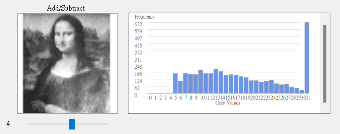

## 2. Arithmetic Operations on the Image Array

### Add or subtract a constant

Adding a constant to every gray value (clamped to a maximum of 31) shifts the whole
histogram to the right; as the constant grows the image gradually turns white.

| +4 | +8 | +12 |
|:--:|:--:|:--:|
| 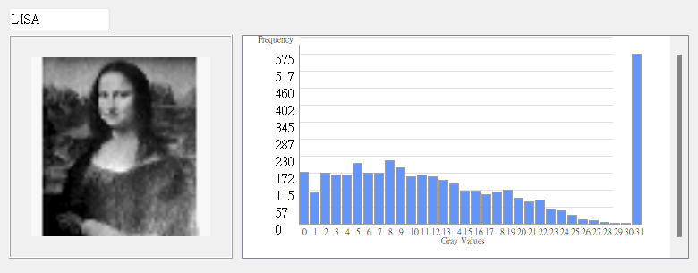 | 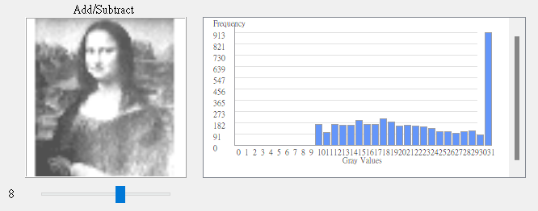 | 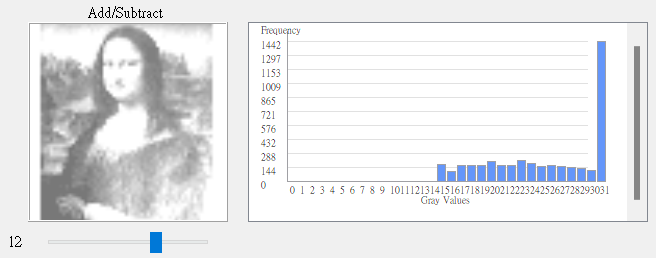 |

Subtracting a constant (clamped to a minimum of 0) shifts the histogram to the left;
the image gradually turns black.

| −4 | −8 | −12 |
|:--:|:--:|:--:|
| 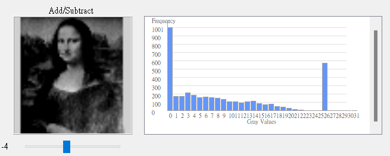 | 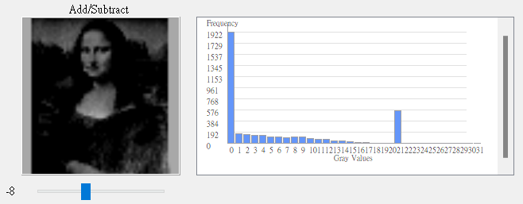 | 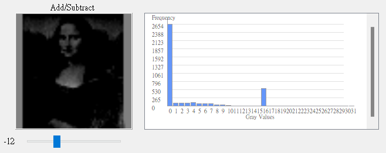 |

### Multiply by a constant

Multiplying every gray value spreads the histogram out and the image becomes brighter
overall. Pixels that were originally `0` stay `0` after multiplication.

| ×2 | ×4 | ×6 |
|:--:|:--:|:--:|
| 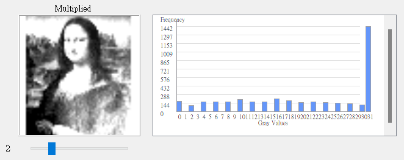 | 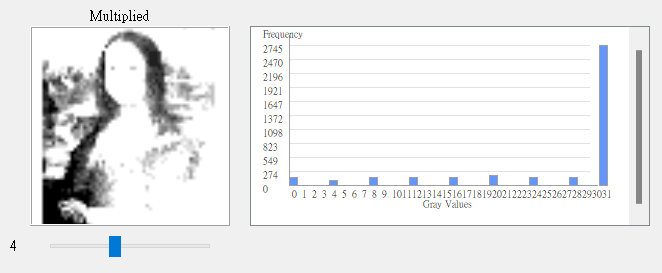 | 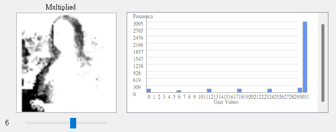 |

### Average of two images

Adding two images and dividing by two blends them as if both were semi-transparent; the
histogram becomes the average of the two input histograms.

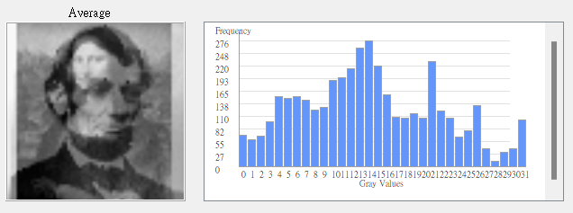

### Difference (gradient) image

$$g(x, y) = f(x, y) - f(x-1, y)$$

Each pixel is replaced by its difference from the pixel to its left. This amplifies
intensity changes and highlights object boundaries.

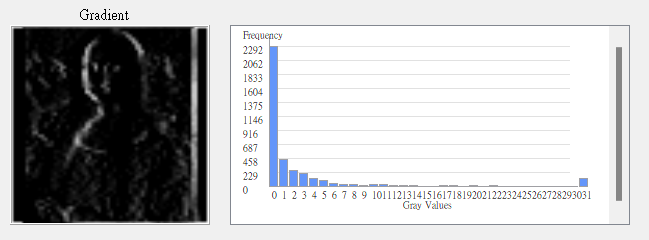

## 3. User Interface

Histogram viewer for the four sample images (LISA, JET, LIBERTY, LINCOLN):

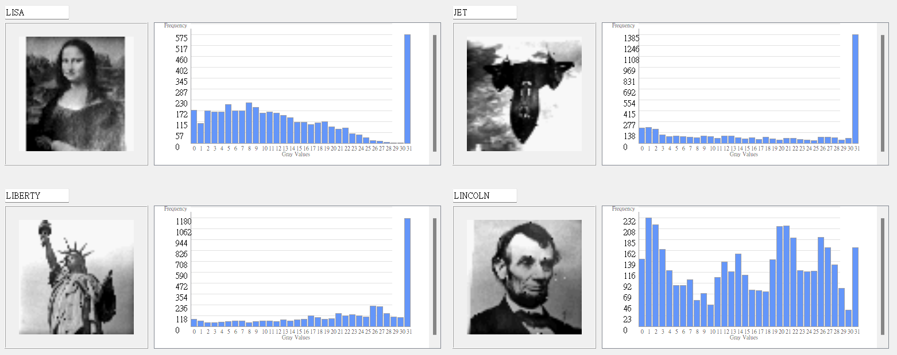

Arithmetic operations panel:

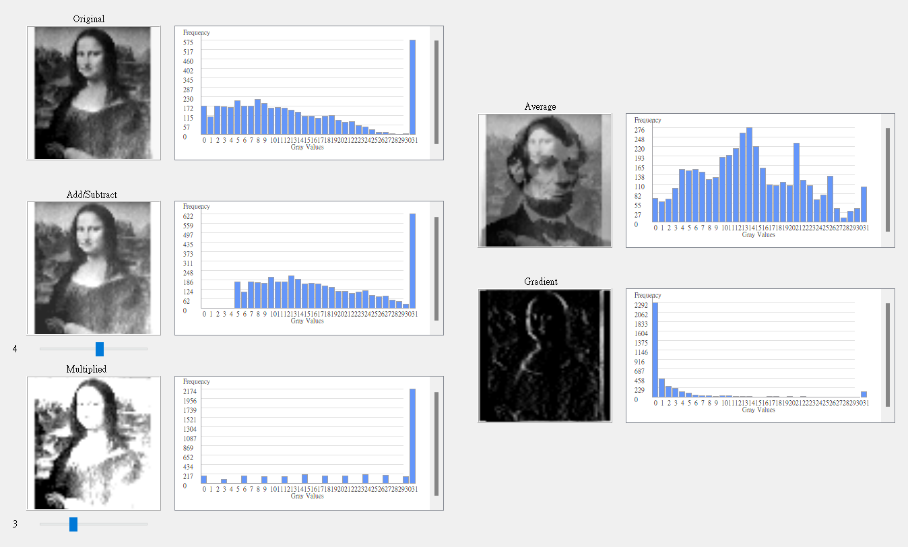

---

## Run

Windows only. Open `bin/GrayLevelHistogram.exe`. The Qt runtime and the sample images
(`bin/images/*.64`) are already bundled next to the executable.

## Build

```bash
cmake -S src -B build -G Ninja -DCMAKE_PREFIX_PATH=<path-to-Qt>
cmake --build build
```

The program loads `images/LISA.64` and the other samples relative to its working
directory, so run it from a folder that contains the `images/` directory (e.g. copy
`bin/images` next to the built executable).

## Structure

```text
src/    C++ / Qt source (main.cpp, mainwindow.*, CMakeLists.txt)
bin/    prebuilt Windows executable + Qt runtime + sample images
docs/   figures used in this README
```
