# Geometric Transforms, Wavelet Fusion & SLIC Superpixels

A Qt desktop tool with three parts: creative geometric warps (fisheye, kaleidoscope,
wavy, spiral, ripple), image fusion with the discrete wavelet transform, and
superpixel segmentation with SLIC.

**Highlights**

- Five polar / sinusoidal geometric transformations with an intensity parameter
- DWT-based image fusion using the maximum-selection rule
- SLIC (Simple Linear Iterative Clustering) superpixels with adjustable superpixel count

---

## 1. Geometric Transformation

| Original | Fisheye | Kaleidoscope |
|:--:|:--:|:--:|
| 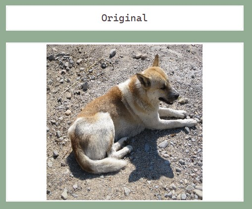 | 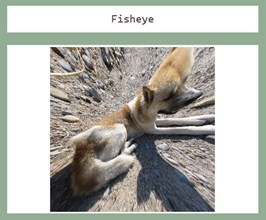 | 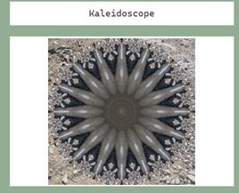 |
| **Wavy** | **Spiral** | **Ripple** |
| 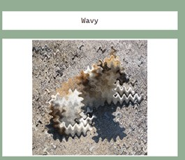 | 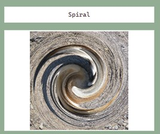 | 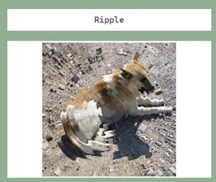 |

**Fisheye**

1. Compute each pixel's distance and angle from the center using trigonometry.
2. Scale the distance with the transformation formula so that pixels closer to the
   center are distorted more (controlled by the intensity parameter).
3. Re-assign the transformed pixels within bounds and display the result.

**Kaleidoscope**

1. Compute the center coordinates.
2. The intensity sets the number of segments; each segment spans an angle of
   `2·π / segments`.
3. Fold each pixel's angle so it is symmetric within its segment.
4. Re-assign the transformed pixels within bounds and display the result.

**Wavy**

1. Shift each pixel's x / y coordinates with a sine function (frequency and intensity).
2. Compute the shift from the row (y) and column (x) of every pixel.
3. Re-assign the transformed pixels within bounds and display the result.

**Spiral**

1. Compute each pixel's distance and angle from the center.
2. Increase the angle in proportion to the distance from the center
   (`distance × intensity`).
3. Re-assign the transformed pixels within bounds and display the result.

**Ripple**

1. Compute each pixel's distance and angle from the center.
2. Add a sinusoidal ripple to the distance; frequency is 0.1 and the amplitude is the
   intensity.
3. Re-assign the transformed pixels within bounds and display the result.

## 2. Image Fusion with the Wavelet Transform

1. The images to be fused must have the same size, with a resolution that is a power of two.
2. Apply the 2-D discrete wavelet transform (DWT) to the resized images.
3. **Fusion rule** – maximum selection: compare the DWT coefficients of the images and
   keep the larger one.
4. After selecting the fused low- and high-frequency bands, reconstruct the fused image
   with the inverse transform.

Sub-bands: **LL** (approximation), **LH** (horizontal details), **HL** (vertical details),
**HH** (diagonal details).

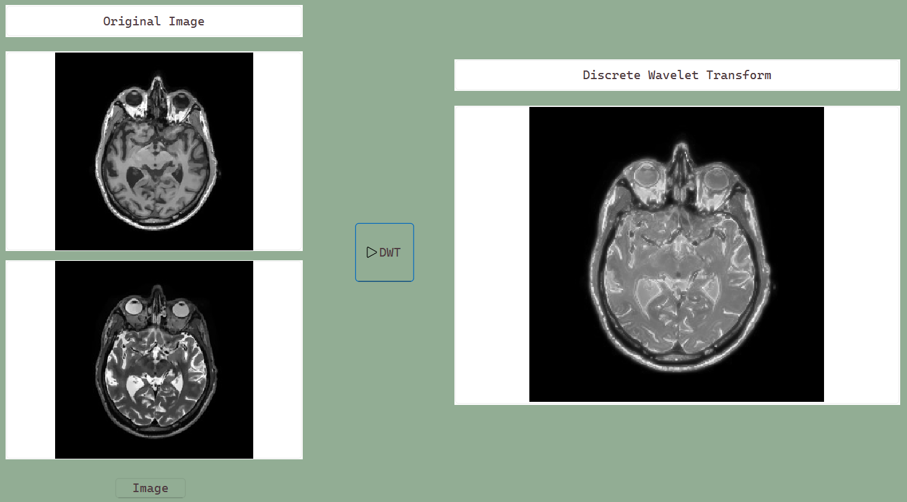

## 3. Superpixel Segmentation (SLIC)

An image is segmented into superpixels with Simple Linear Iterative Clustering (SLIC),
and the number of superpixels is tuned for the best result.

| 150 superpixels | 200 superpixels |
|:--:|:--:|
| 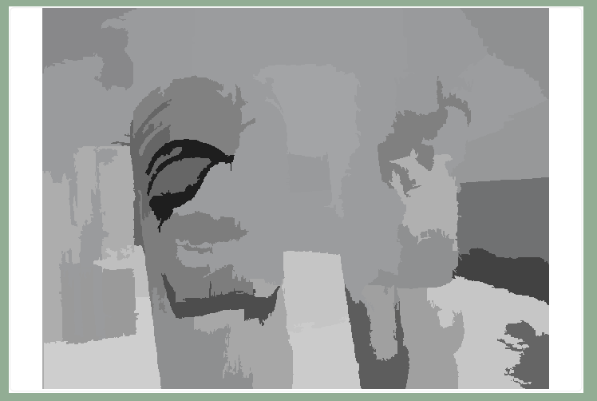 | 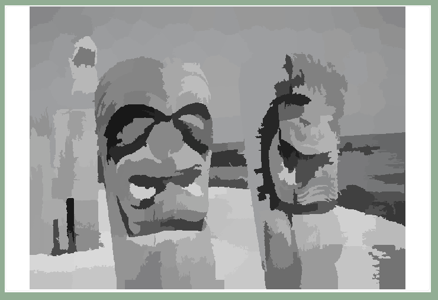 |
| **300 superpixels** | **500 superpixels** |
| 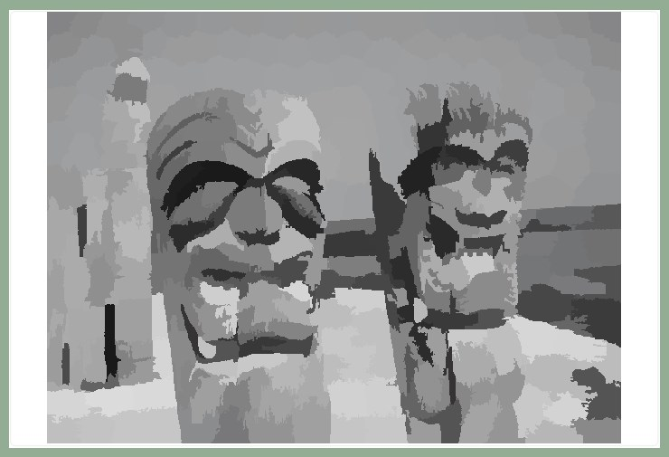 | 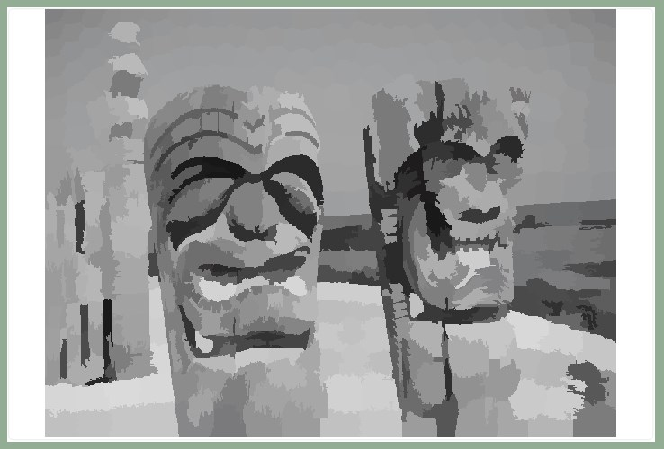 |

1. Each pixel is assigned to a cluster center based on color and spatial coordinates:
   - **Color distance** – difference in RGB.
   - **Spatial distance** – difference in pixel coordinates.
2. Neighboring pixels are compared to detect boundaries between clusters, and the
   boundaries are drawn in white `(255, 255, 255)`.

---

## Run

Windows only. Open `bin/GeometricWaveletSLIC.exe`. The Qt / OpenCV runtime and the test
images (`bin/IP_dog.bmp`, `bin/MRI1.jpg`, `bin/MRI2.jpg`, `bin/totem-poles.jpg`) are
bundled next to the executable.

## Build

Requires Qt 6 and OpenCV. Set `OpenCV_DIR` in `src/CMakeLists.txt` to your OpenCV build.

```bash
cmake -S src -B build -G Ninja -DCMAKE_PREFIX_PATH=<path-to-Qt>
cmake --build build
```

Test images are loaded relative to the working directory; copy them from `bin/` next to
the built executable.

## Structure

```text
src/    C++ / Qt source (main.cpp, mainwindow.*, slic.*, CMakeLists.txt)
bin/    prebuilt Windows executable + Qt / OpenCV runtime + test images
docs/   figures used in this README
```
