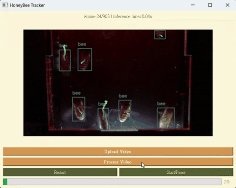
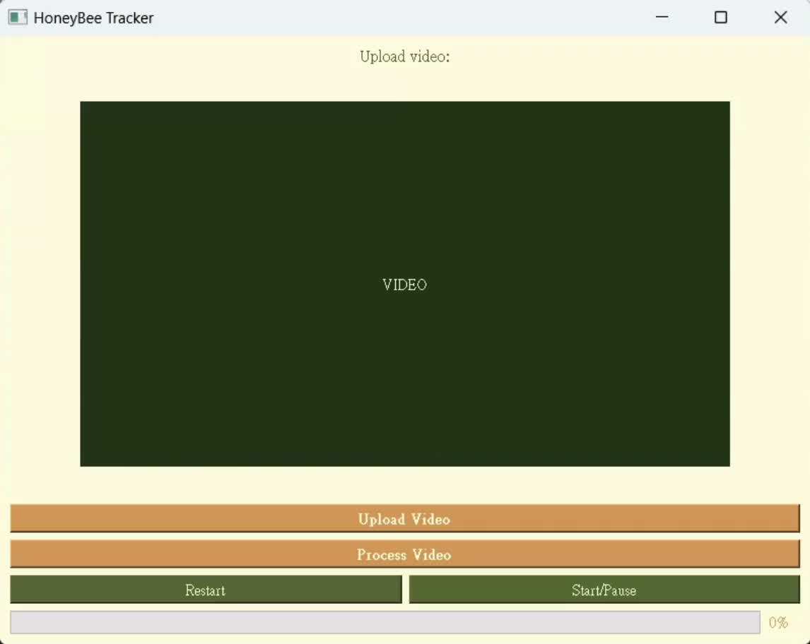
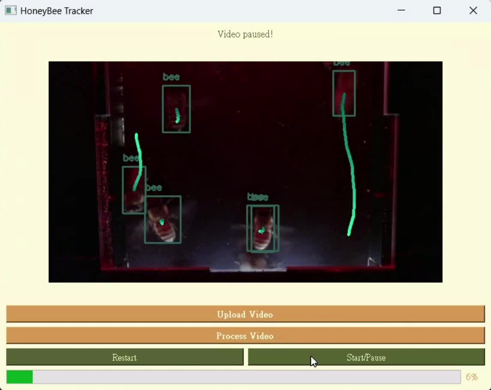
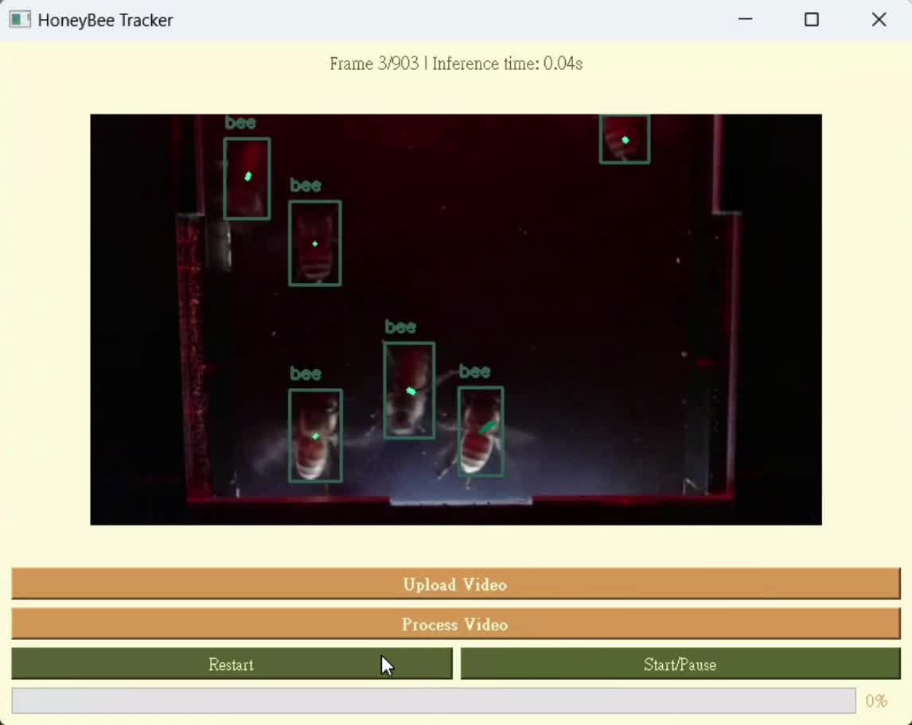

# HoneyBee Tracker

A desktop application that detects and tracks honeybees in video. A video is loaded
through the GUI, each frame is processed, and every detected bee is drawn with a
labeled bounding box and its motion trail.

**Features**

- **Upload Video** – choose a video file from disk
- **Process Video** – run detection and tracking frame by frame
- **Start / Pause** and **Restart** playback controls
- Per-detection `bee` bounding boxes with motion trails
- Status line with the current frame index and per-frame inference time
- Progress bar for the processing run

## Screenshots

| Start screen | Tracking |
|:--:|:--:|
|  |  |

Full screen recording: [`docs/demo.mp4`](docs/demo.mp4)

> Only the demo recording is included in this repository; the application source is
> not part of it.
