# Project 2 — Image Enhancement & Histogram Processing

A Qt desktop tool for reading a color image and applying basic point operations:
grayscale conversion, thresholding, resampling, gray-level quantization,
brightness / contrast adjustment and histogram equalization, each with a live histogram.

**Highlights**

- Two grayscale conversion formulas compared by image subtraction
- Interactive binary thresholding
- Spatial resolution scaling with interpolation and gray-level reduction
- Brightness & contrast transform around mid-gray
- Histogram equalization via the cumulative distribution function (CDF)

---

## 1. Read and Display a Color Image

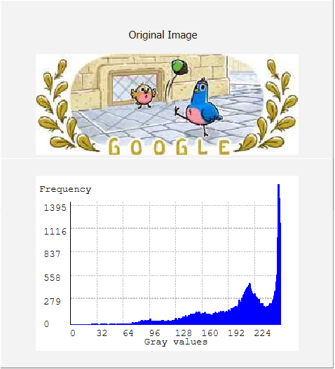

## 2. Color → Grayscale

Two conversion equations are implemented:

- **A (simple average):** `GRAY = (R + G + B) / 3.0`
- **B (perceptual weighting):** `GRAY = 0.299·R + 0.587·G + 0.114·B`

The histogram of each grayscale image is computed and displayed.

| Gray A – average | Gray B – weighted |
|:--:|:--:|
| 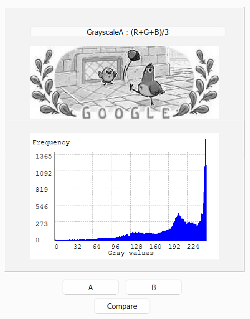 | 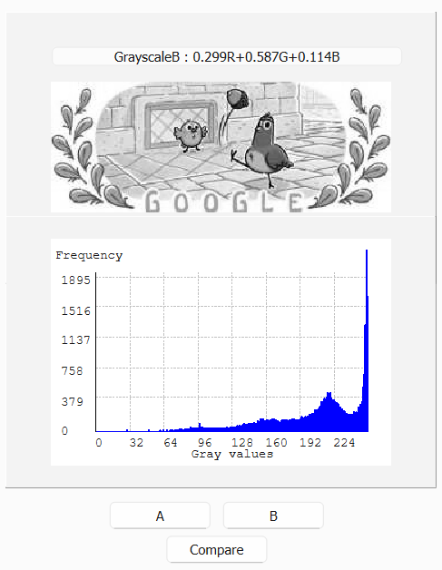 |

The two results are compared by image subtraction `|A − B|`:

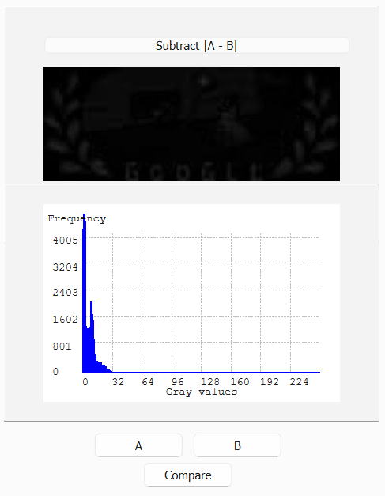

- **grayA** averages the red, green and blue values equally.
- **grayB** weights them according to human perception (0.299 R, 0.587 G, 0.114 B).

## 3. Manual Thresholding

A slider sets the threshold that converts the grayscale image into a binary image.

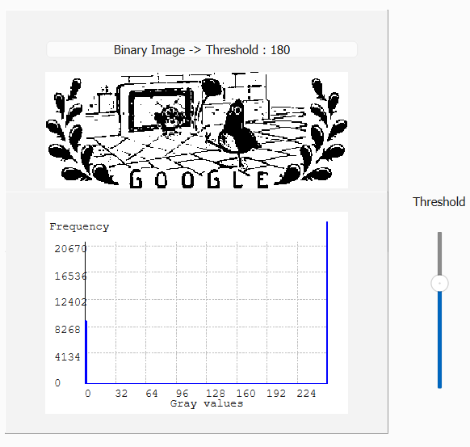

## 4. Spatial Resolution & Gray Levels

Enlarge or shrink the image (interpolation is used when enlarging) and reduce the number
of gray levels. Resampling is useful for zooming in / out or adapting the image size to
different display requirements.

| Resized (50 %) | Gray levels reduced |
|:--:|:--:|
| 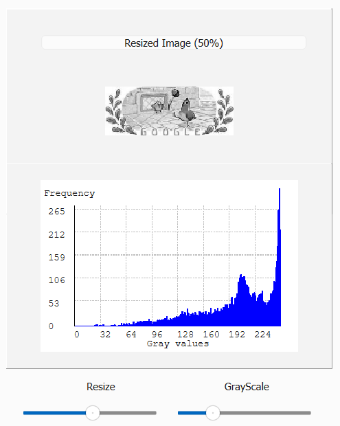 | 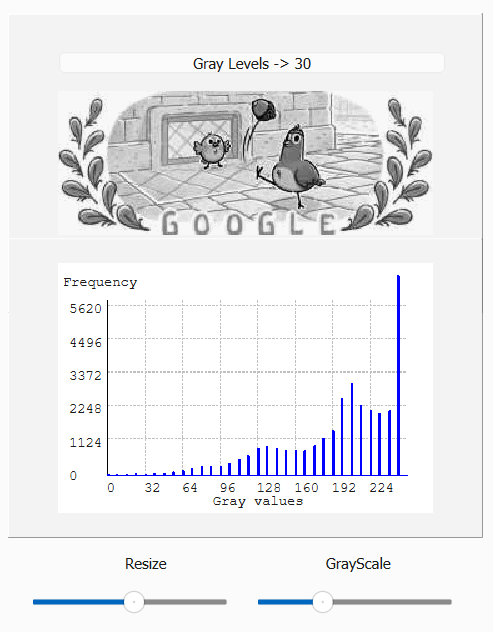 |

## 5. Brightness & Contrast

For each pixel `I(x, y)`:

$$I' = \text{contrast} \times (I - 128) + 128 + \text{brightness}$$

where `I'` is the new pixel value, `I` is the original value and 128 is the midpoint of
the 8-bit grayscale range.

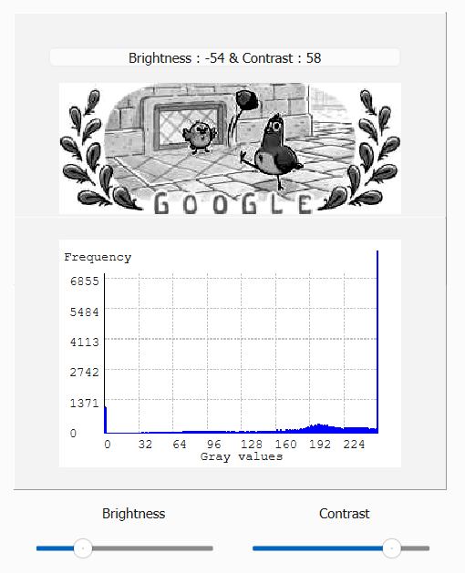

## 6. Histogram Equalization

Automatic contrast adjustment:

- **Histogram calculation** – count the frequency of each intensity value (0–255).
- **Cumulative distribution function** – accumulate the histogram into a CDF, which is
  used to redistribute pixel values across the full intensity range.
- **Pixel value adjustment** – map each pixel through the CDF so the values spread more
  evenly across the grayscale spectrum.


Comparison with the built-in photo editor in iOS:

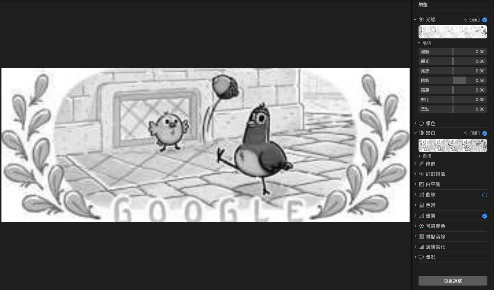


---

## Theory Notes

Hand-worked derivations that back the implementation: illumination & quantization
(false contouring), 4- / 8- / m-path adjacency, inverse affine transforms
(scaling, translation, shearing, rotation), histogram specification and
convolution vs. correlation.

| | |
|:--:|:--:|
| 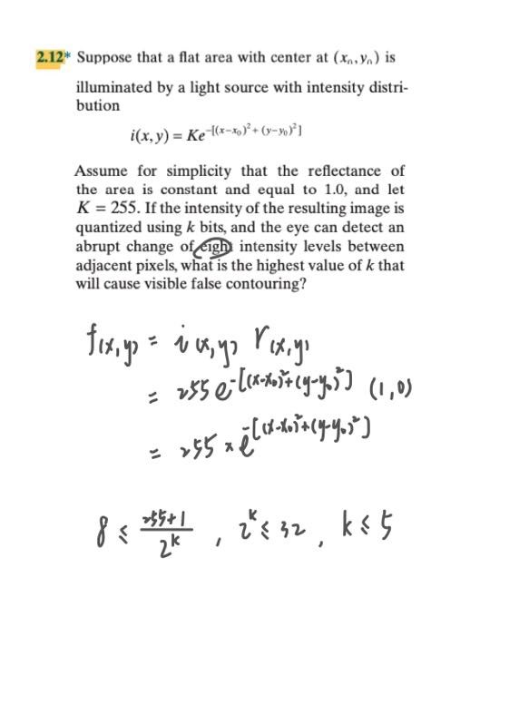 | 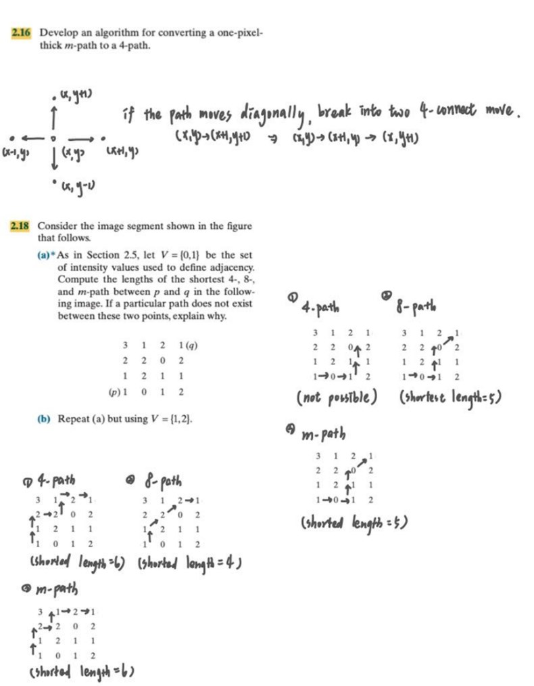 |
| 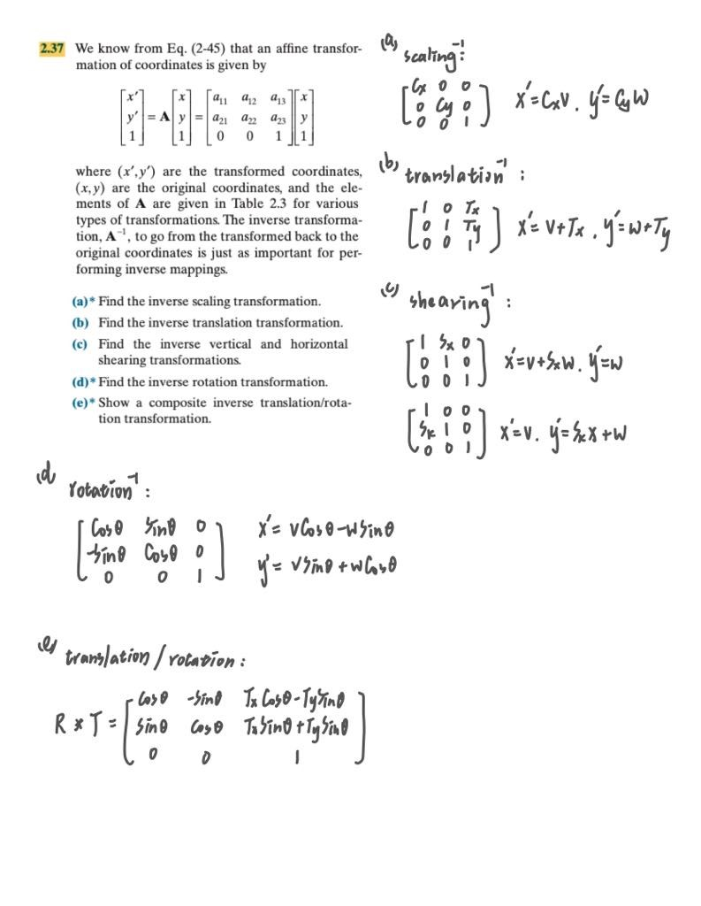 | 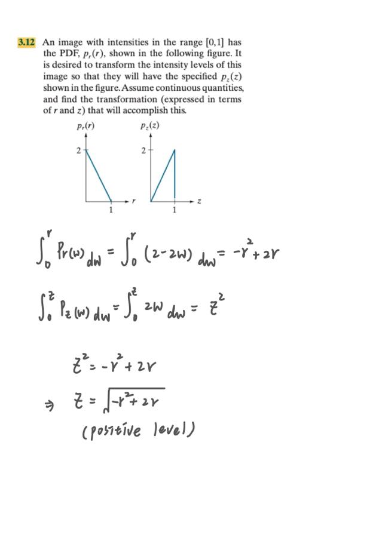 |
| 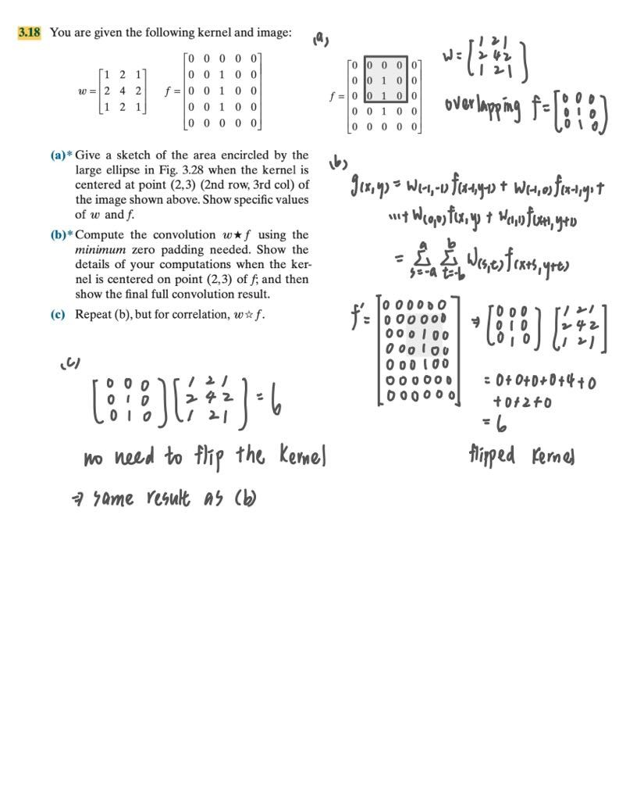 | |

---

## Run

Windows only. Open `bin/ImageEnhancement.exe`. The Qt runtime and the sample image
(`bin/oly.jpg`) are bundled next to the executable.

## Build

Requires Qt 6 and OpenCV. Set `OpenCV_DIR` in `src/CMakeLists.txt` to your OpenCV build.

```bash
cmake -S src -B build -G Ninja -DCMAKE_PREFIX_PATH=<path-to-Qt>
cmake --build build
```

The sample image is loaded relative to the working directory; copy `bin/oly.jpg` next to
the built executable.

## Structure

```text
src/    C++ / Qt source (main.cpp, mainwindow.*, CMakeLists.txt)
bin/    prebuilt Windows executable + Qt runtime + sample image
docs/   figures used in this README
```
