# Project 4 — Frequency-Domain Filtering & Image Restoration

A Qt desktop tool for frequency-domain processing: FFT spectrum and phase display,
ideal / Butterworth / Gaussian low- and high-pass filters, homomorphic filtering, and
restoration of a motion-blurred image with inverse and Wiener filters.

**Highlights**

- FFT with log-scaled, normalized spectrum display, phase angle and IDFT reconstruction
- Ideal, Butterworth and Gaussian filters with adjustable cut-off frequency
- Homomorphic filter with adjustable `γH`, `γL` and `D0`
- Motion-blur simulation, inverse filtering and Wiener filtering

---

## 1. Fourier Transform (FFT)

The program performs a Fourier transform using the FFT and shows the image spectrum,
the phase angle and the inverse-DFT result. The spectrum is log-scaled and normalized
for display:

```text
FMIN = log(1 + |Fmin|)        Fmin: minimum value of the F(u,v) spectrum
FMAX = log(1 + |Fmax|)        Fmax: maximum value of the F(u,v) spectrum
YNEW(u,v) = G · [ log(1 + |F(u,v)|) − FMIN ] / [ FMAX − FMIN ]
```

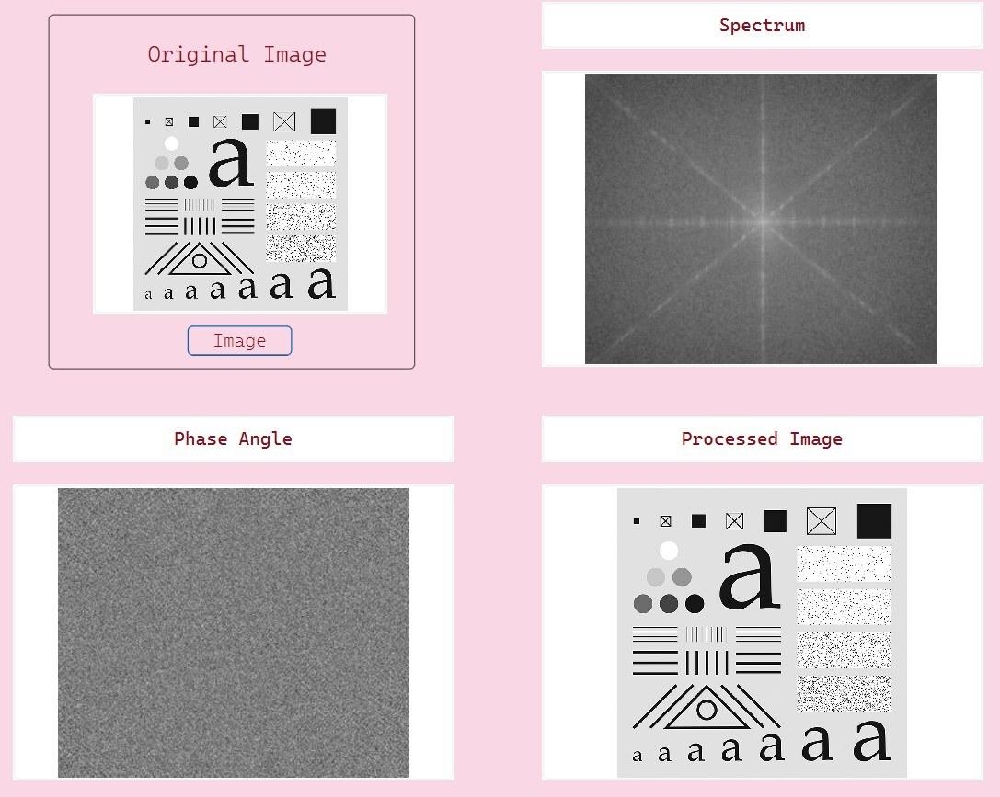

## 2. Low-pass & High-pass Filtering

Low-pass and high-pass filtering with ideal, Butterworth and Gaussian transfer
functions. The cut-off frequency is adjustable.

### Ideal filter

| Cut-off = 15 | Cut-off = 48 |
|:--:|:--:|
| 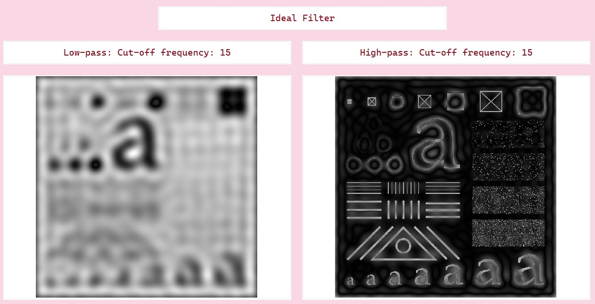 | 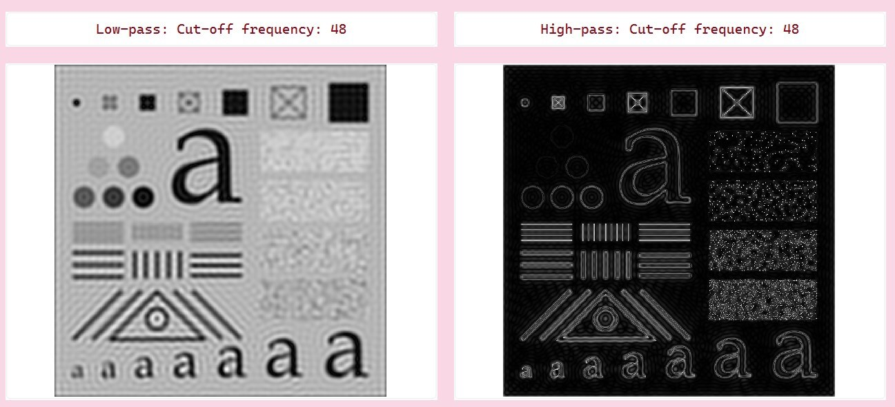 |

### Butterworth filter

| Cut-off = 15 | Cut-off = 48 |
|:--:|:--:|
| 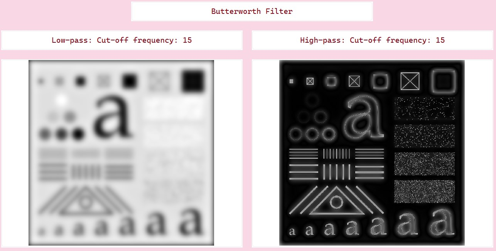 | 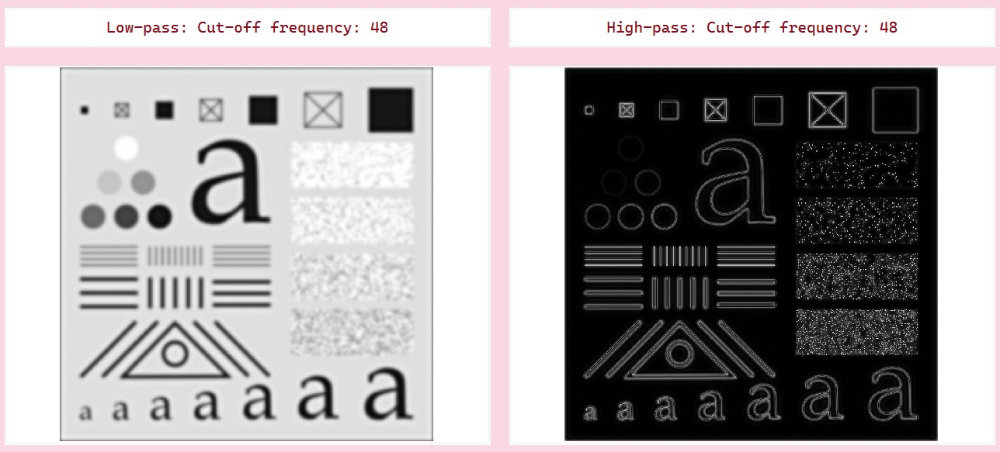 |

### Gaussian filter

| Cut-off = 15 | Cut-off = 48 |
|:--:|:--:|
| 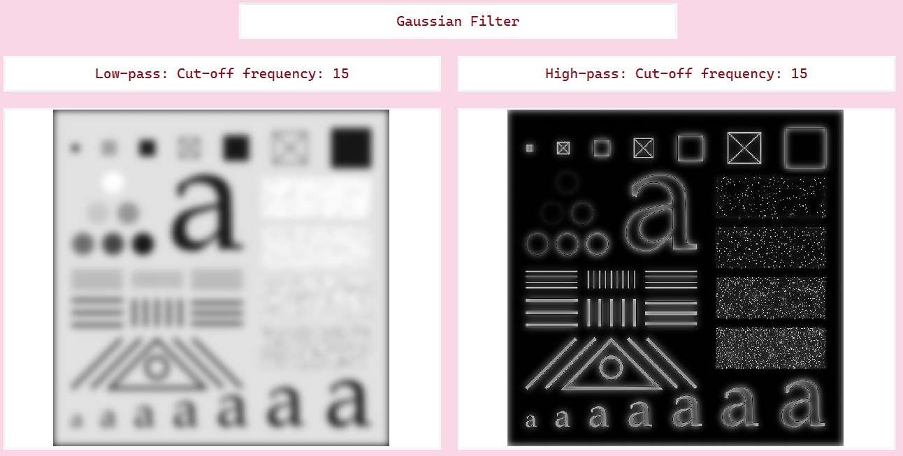 | 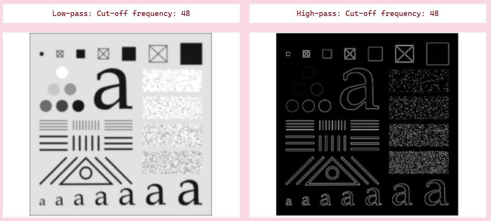 |

## 3. Homomorphic Filtering

Homomorphic filtering with three adjustable parameters: `γH`, `γL` and `D0`.

$$H(u, v) = (\gamma_H - \gamma_L)\left[1 - e^{-c\,D^2(u, v) / D_0^2}\right] + \gamma_L$$

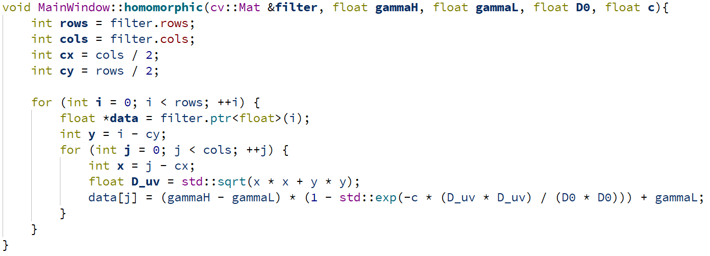

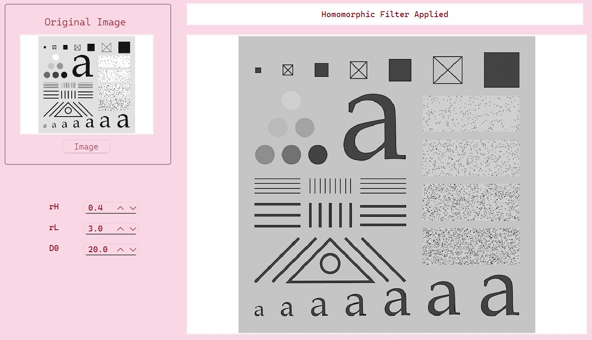

## 4. Motion Blur & Restoration

A motion-blurred image is generated, then restored with a 2-D frequency-domain inverse
filter and a Wiener filter.

| Inverse filter | Wiener filter |
|:--:|:--:|
| 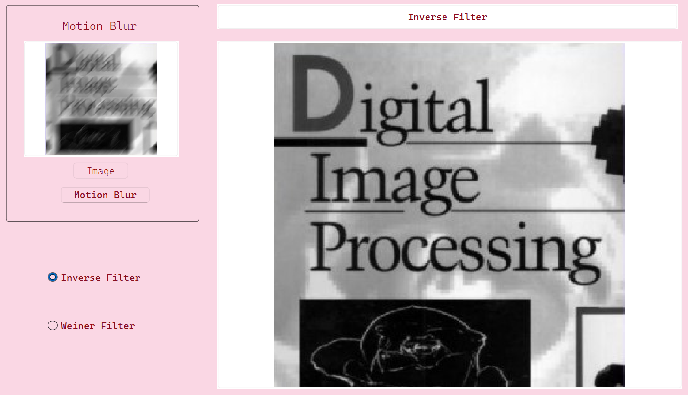 | 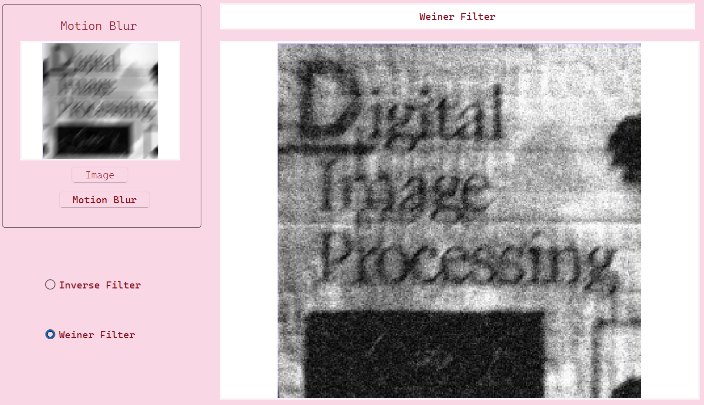 |

---

## Run

Windows only. Open `bin/FrequencyDomain.exe`. The Qt runtime and the test images
(`bin/IMG01.jpg`, `bin/IMG02.bmp`, `bin/image/*.jpg`) are bundled next to the executable.

## Build

Requires Qt 6 and OpenCV. Set `OpenCV_DIR` in `src/CMakeLists.txt` to your OpenCV build.

```bash
cmake -S src -B build -G Ninja -DCMAKE_PREFIX_PATH=<path-to-Qt>
cmake --build build
```

Test images are loaded relative to the working directory; copy `IMG01.jpg`, `IMG02.bmp`
and the `image/` folder from `bin/` next to the built executable.

## Structure

```text
src/    C++ / Qt source (main.cpp, mainwindow.*, CMakeLists.txt)
bin/    prebuilt Windows executable + Qt runtime + test images
docs/   figures used in this README
```
