# Project 5 — Color Processing & K-means Segmentation

A Qt desktop tool for color image processing: conversion between color models,
pseudo-color mapping with a color bar, and image segmentation by k-means color
clustering in different color spaces.

**Highlights**

- RGB → CMY, HSI, XYZ, L\*a\*b\*, YUV conversions
- Grayscale vs. pseudo-color display with the matching color table
- K-means clustering segmentation in RGB, L\*a\*b\* and HSI (k = 2, 10, 50)

---

## 1. Color Model Conversion

Convert an image into the RGB, CMY, HSI, XYZ, L\*a\*b\* and YUV color planes.

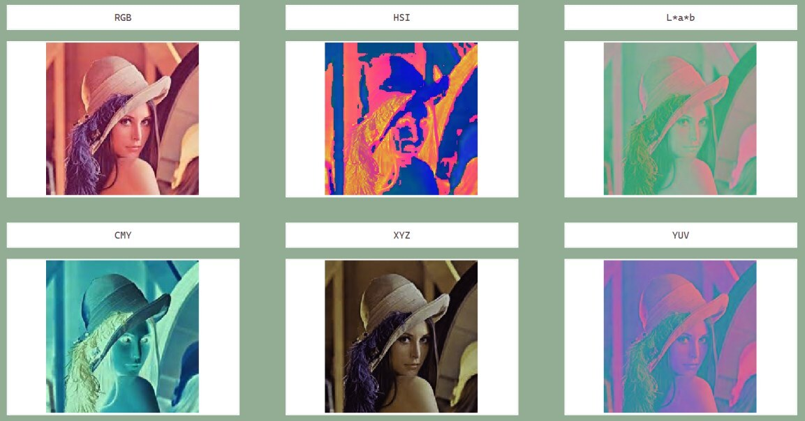

### Algorithms

**RGB → CMY.** CMY is the inverse of the RGB components:

```text
C = 255 − R
M = 255 − G
Y = 255 − B
```

**RGB → HSI.**

- **Hue (H)** – the angle between the color and the reference axis, computed with
  trigonometric functions, in the range `[0, 360]` degrees.
- **Saturation (S)** – how far the color is from gray, relative to the maximum possible value.
- **Intensity (I)** – the average of the R, G and B components.

The conversion separates chromatic information (H and S) from intensity, which helps
analyze visual aspects such as shading.

**XYZ → L\*a\*b\*.** Produces a perceptually uniform color space that normalizes color
perception and emphasizes color contrast, which is helpful for segmentation and analysis.

**RGB → YUV.**

- **Y (luminance)** – a weighted sum of the RGB components.
- **U and V** – chromatic information that carries color contrast.

YUV is valuable where brightness and color need to be separated, e.g. video compression.

## 2. Pseudo-color

Display the grayscale image next to pseudo-color versions and show the color table
(color bar) with its corresponding gray levels.

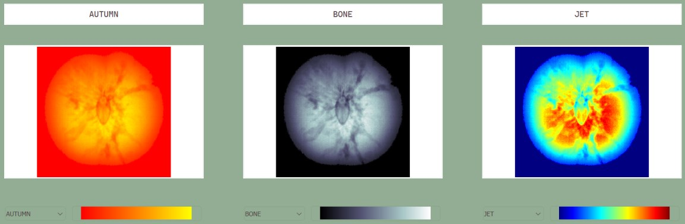
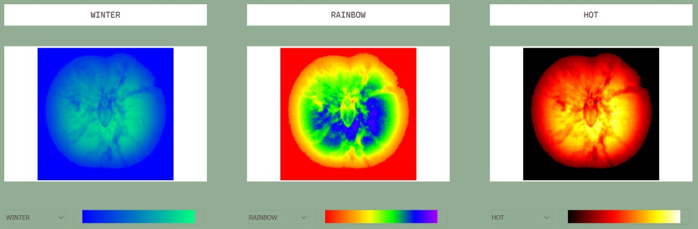

OpenCV's `applyColorMap()` converts grayscale images into pseudo-color representations.
The program also generates a color bar that shows the mapping between gray values and
the colors used.

## 3. K-means Color Segmentation

Image segmentation by color clustering with the k-means algorithm, comparing results
in the RGB, HSI and L\*a\*b\* color planes.

### RGB

| k = 2 | k = 10 | k = 50 |
|:--:|:--:|:--:|
| 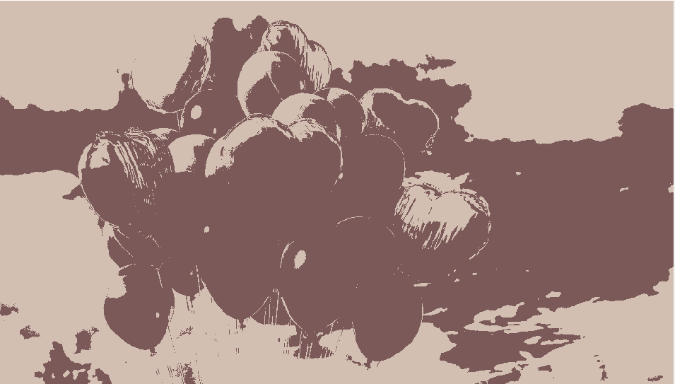 | 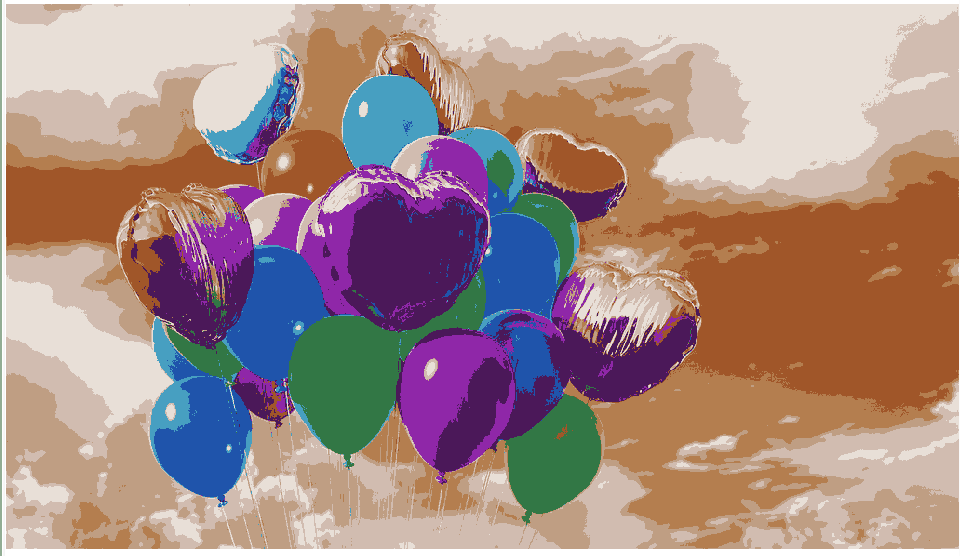 |  |

### L\*a\*b\*

| k = 2 | k = 10 | k = 50 |
|:--:|:--:|:--:|
| 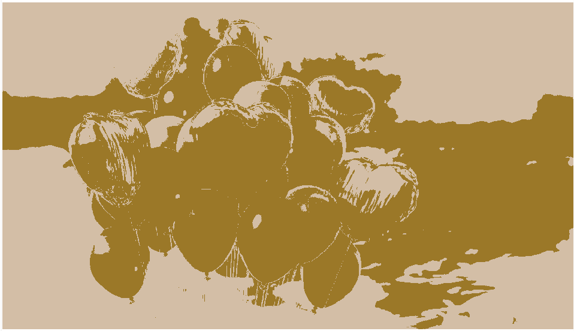 | 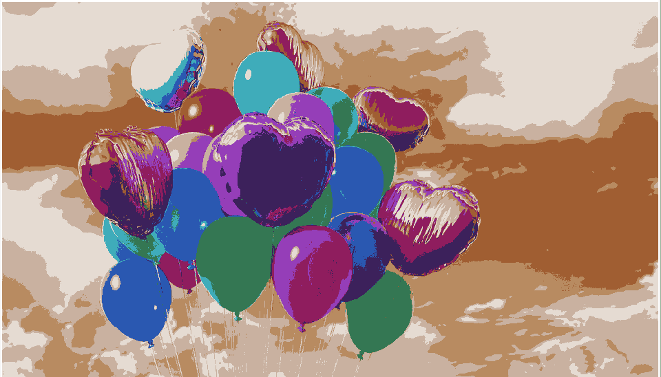 | 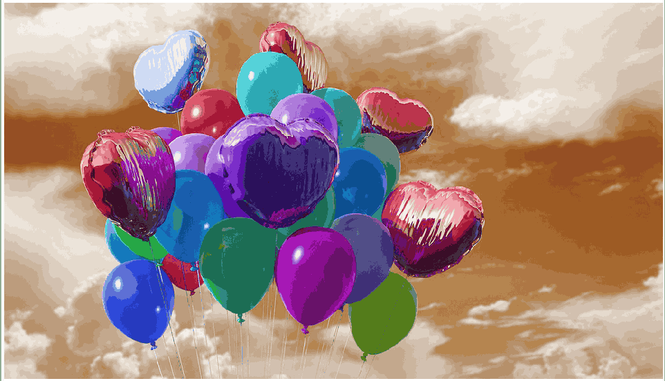 |

### HSI

| k = 2 | k = 10 | k = 50 |
|:--:|:--:|:--:|
| 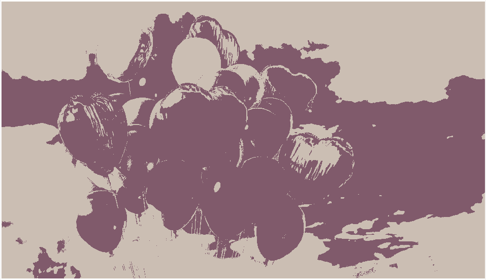 | 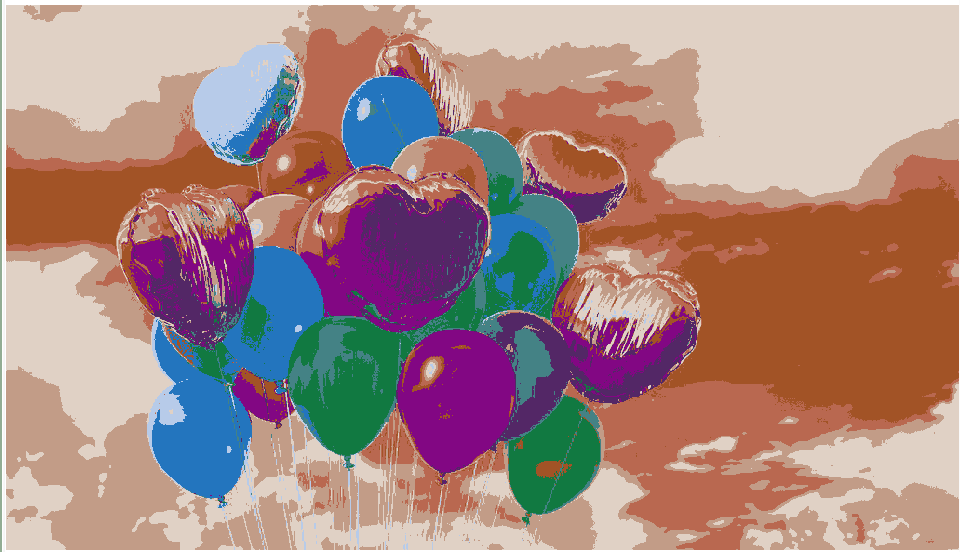 | 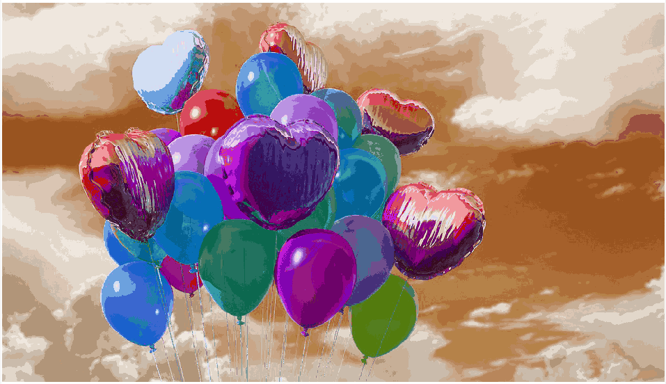 |

### Algorithm

K-means is an unsupervised clustering algorithm. Each pixel is treated as a data point
in a color space, and k-means groups similar pixels into `k` clusters by minimizing the
sum of squared distances between pixels and their cluster centers.

1. **Data preparation** – convert the input image into the selected color space
   (RGB, HSI or L\*a\*b\*).
2. **Normalization** – normalize the color components to `[0, 1]`, then run OpenCV
   `kmeans()` on the reshaped pixel matrix to split the pixels into `k` clusters.
3. **Assigning colors** – give every cluster a distinct color by mapping each pixel to
   its nearest cluster center, producing the segmented image.
4. **Visualization** – convert the segmented image back to RGB for display.

---

## Run

Windows only. Open `bin/ColorSegmentation.exe`. The Qt runtime and the test images
(`bin/images.jpg`, `bin/HW05-Part 2-01.bmp`, `bin/HW05-Part 3-04.bmp`) are bundled next
to the executable. The image file names are referenced by the executable, so keep them
unchanged.

> This build was compiled in Debug mode and ships the Qt debug libraries (`Qt6*d.dll`).

## Build

Requires Qt 6 and OpenCV. Set `OpenCV_DIR` in `src/CMakeLists.txt` to your OpenCV build.

```bash
cmake -S src -B build -G Ninja -DCMAKE_PREFIX_PATH=<path-to-Qt>
cmake --build build
```

Test images are loaded relative to the working directory; copy the image files from
`bin/` next to the built executable.

## Structure

```text
src/    C++ / Qt source (main.cpp, mainwindow.*, CMakeLists.txt)
bin/    prebuilt Windows executable + Qt runtime + test images
docs/   figures used in this README
```
