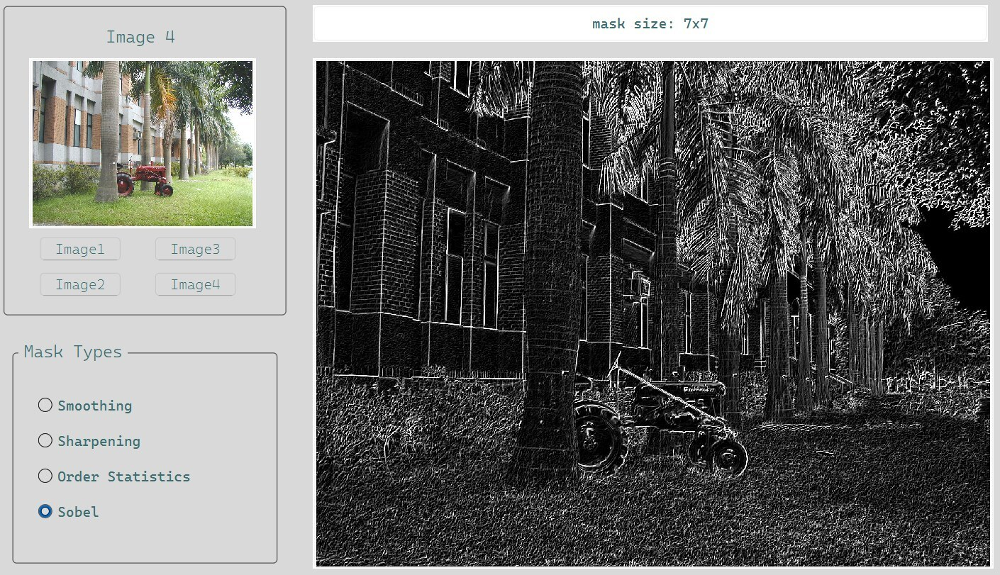

# Digital Image Processing — C++ / Qt

A collection of desktop image-processing tools written in C++17 with Qt (and OpenCV
where needed). Each project is a self-contained GUI application with its source code,
a prebuilt Windows executable and a write-up with result images.

## ▶ Try it in the browser

**[Image Processing Lab](https://qquicksand.github.io/Digital_Image_Processing/)** runs all
six projects in one page on any OS (macOS, Windows, Linux, mobile). The algorithms are a
portable C++17 core compiled to WebAssembly; see [`web/`](web/) for the source and how to
build it locally.

| # | Project | Topics |
|---|---|---|
| 01 | [Gray-Level Operations & Histogram Analysis](01-gray-level-histogram/) | `.64` image decoding, histogram, add / subtract / multiply, averaging, gradient |
| 02 | [Image Enhancement & Histogram Processing](02-image-enhancement/) | grayscale conversion, thresholding, resampling, brightness / contrast, histogram equalization |
| 03 | [Spatial Filtering & Edge Detection](03-spatial-filtering-edge-detection/) | smoothing, sharpening, median, Sobel, Marr-Hildreth (LoG), local enhancement |
| 04 | [Frequency-Domain Filtering & Image Restoration](04-frequency-domain-restoration/) | FFT, ideal / Butterworth / Gaussian filters, homomorphic filtering, inverse & Wiener filters |
| 05 | [Color Processing & K-means Segmentation](05-color-processing-segmentation/) | RGB / CMY / HSI / XYZ / L\*a\*b\* / YUV, pseudo-color, k-means segmentation |
| 06 | [Geometric Transforms, Wavelet Fusion & SLIC Superpixels](06-geometric-wavelet-superpixel/) | fisheye, kaleidoscope, wavy, spiral, ripple, DWT fusion, SLIC |
| 07 | [HoneyBee Tracker](07-honeybee-tracker/) | bee detection & tracking in video (demo) |

## Preview

| Histogram | Enhancement | Edge detection |
|:--:|:--:|:--:|
|  |  |  |
| **Frequency domain** | **Color segmentation** | **Geometric transforms** |
|  |  |  |

## Quick Start (Windows desktop apps)

1. Clone the repository (Git LFS is used for the bundled `.dll` files):

   ```bash
   git lfs install
   git clone https://github.com/QQuicksand/Digital_Image_Processing.git
   ```

2. Open a project's `bin/` folder and run its `.exe`. The Qt runtime and sample images
   are bundled, so the GUI starts directly.

## Project Layout

```text
web/               cross-platform browser version (C++17 → WebAssembly)
NN-project-name/
├── README.md      write-up with algorithms and result images
├── src/           C++ / Qt source and CMakeLists.txt
├── bin/           prebuilt Windows executable, runtime DLLs and sample images
└── docs/images/   figures used in the write-up
```

## Building from Source

Each `src/` folder is a standalone CMake project:

```bash
cmake -S <project>/src -B build -G Ninja -DCMAKE_PREFIX_PATH=<path-to-Qt>
cmake --build build
```

Projects 02, 04, 05 and 06 also need OpenCV; point `OpenCV_DIR` in their
`CMakeLists.txt` to your OpenCV build. Sample images are loaded relative to the working
directory, so copy them from `bin/` next to the built executable.

## Technologies

- C++17
- Qt 5 / Qt 6 (Widgets)
- OpenCV
- CMake / Ninja
- Emscripten / WebAssembly
