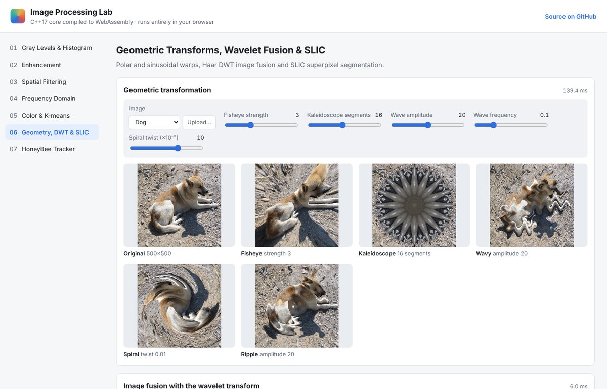

# Image Processing Lab (Web)

All six image-processing projects from
[Digital_Image_Processing](https://github.com/QQuicksand/Digital_Image_Processing) in one
browser app. The algorithms are written in
portable **C++17** (no Qt, no OpenCV) and compiled to **WebAssembly** with Emscripten, so
the app runs on macOS, Windows, Linux and mobile without installing anything.

**Live demo:** https://qquicksand.github.io/Digital_Image_Processing/



| Tab | Tools |
|---|---|
| 01 Gray levels | `.64` decoding, 32-bin histogram, add / subtract / multiply, averaging, difference image |
| 02 Enhancement | grayscale A / B / \|A−B\|, threshold, bilinear resampling, gray-level reduction, brightness / contrast, histogram equalization |
| 03 Spatial filtering | smoothing, sharpening, median, Sobel, Marr-Hildreth (LoG + zero crossings), local enhancement vs. histogram equalization |
| 04 Frequency domain | FFT spectrum / phase / IDFT, ideal / Butterworth / Gaussian filters, homomorphic filter, motion blur + inverse / Wiener restoration |
| 05 Color | CMY, HSI, XYZ, L\*a\*b\*, YUV, pseudo-color with color bar, k-means segmentation in RGB / HSI / L\*a\*b\* |
| 06 Geometry | fisheye, kaleidoscope, wavy, spiral, ripple, Haar DWT image fusion, SLIC superpixels |
| 07 HoneyBee Tracker | demo recording |

Every tool works on the bundled sample images or on an image you upload. Images are
processed locally in the browser; nothing is sent to a server.

## Architecture

```text
.
├── core/               C++17 image-processing library (dip.hpp + one .cpp per topic)
│   ├── basic.cpp       image helpers, gray-level ops (01), enhancement (02)
│   ├── spatial.cpp     filters, Marr-Hildreth, local enhancement (03)
│   ├── frequency.cpp   radix-2 FFT, frequency filters, restoration (04)
│   ├── color.cpp       color models, color maps, k-means (05)
│   └── geometry.cpp    warps, Haar wavelet fusion, SLIC (06)
├── bindings/           Emscripten embind layer (images cross as RGBA ImageData)
├── tests/              native unit tests for the core
├── site/               static web page (index.html, app.js, style.css, samples/)
└── CMakeLists.txt      native build → tests, Emscripten build → site/dip.js + dip.wasm
```

The same `core/` compiles natively (for the tests) and to WebAssembly (for the site).

## Run locally (macOS / Linux / Windows)

1. Install Emscripten, e.g. on macOS:

   ```bash
   brew install emscripten cmake ninja
   ```

   or follow the [emsdk instructions](https://emscripten.org/docs/getting_started/downloads.html).

2. Build the WebAssembly module (writes `site/dip.js` and `site/dip.wasm`):

   ```bash
   emcmake cmake -S . -B build/wasm -G Ninja
   cmake --build build/wasm
   ```

3. Serve the site and open http://localhost:8000:

   ```bash
   python3 -m http.server 8000 --directory site
   ```

   The page must be served over HTTP; opening `index.html` directly from disk does not
   load WebAssembly.

## Tests

```bash
cmake -S . -B build/native
cmake --build build/native
ctest --test-dir build/native --output-on-failure
```

## Deployment

`.github/workflows/web.yml` runs the native tests, compiles the WebAssembly module and
publishes `site/` to GitHub Pages on every push to the `web-app` branch. One-time setup in
the repository settings:

1. **Pages → Build and deployment → Source:** GitHub Actions.
2. **Environments → github-pages → Deployment branches:** allow `web-app`
   (by default only the default branch may deploy).
